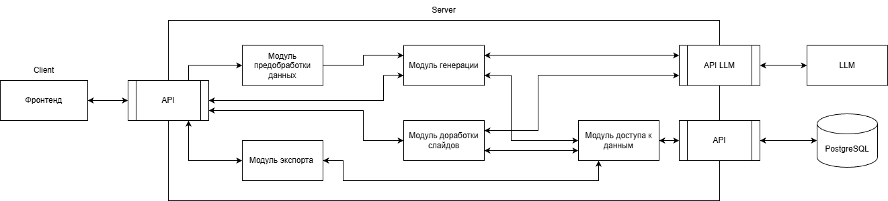

## 1. Общая информация
### 1.1. Название системы
ИИ-генератор презентаций
### 1.2. Назначение системы
Веб-приложение для генерации презентаций на основе пользовательских запросов и финансовых данных.
### 1.3. Входные данные
- Текст запроса пользователя
- CSV-файлы – таблицы с финансовыми данными
### 1.4. Выходные данные
- Презентация в форматах JSON и PPTX

## 2. Функциональные требования
#### 2.1. Создание чата и генерация презентации
FR-01: Система должна позволять пользователю создавать новый чат с указанием текста запроса и добавлением CSV-файла.\
FR-02: Система должна валидировать расширение файла. При несоответствии -- отклонять файл.\
FR-03: Если в момент генерации пользователь закрыл чат или вкладку, система должна продолжить обработку в фоне 
и сохранить результат в бд.\
FR-04: При успешном завершении генерации система должна сохранить JSON-файлы со структурой слайдов в базу данных.\
FR-05: Во время генерации система должна блокировать взаимодействие с чатом, но не блокировать возможность перемещаться 
между чатами и создавать новый чат. 

#### 2.2. Редактирование слайдов
FR-06: Система должна позволять пользователю отправлять текстовые правки к конкретному слайду.\
FR-07: Система должна позволять пользователю менять размер и расположение блоков и тип графиков.\
FR-08: Если пользователь переходит на другой слайд до завершения обработки правки, система должна продолжить генерацию 
в фоне и обновить превью при возврате на исходный слайд.\
FR-09: Система должна блокировать повторную отправку правок к слайду, пока предыдущая правка к этому слайду находиться 
в статусе *processing*.\
FR-10: Система не должна блокировать возможность перемещаться между слайдами при генерации новй версии слайда.\
FR-11: Система должна позволять пользователю выбрать, будет ли слайд входить в презентацию.\
FR-12: Система должна позволять пользователю выбрать версию слайда из существующих.

#### 2.3. Экспорт презентации
FR-13: Система должна предоставлять возможность скачать текущую версию презентации в формате ZIP, который содержит файл 
в формате JSON и файл в формате PPTX.\
FR-14: Во время обработки других задач система должна блокировать кнопку "Скачать".

## 3. Сценарии работы и поведение системы
### 3.1. Сценарии взаимодействия с пользователем
Сценарии взаимодействия пользователя с системой описаны в файле [`scenarios.feature`](scenarios.feature).

### 3.2. Общая логика работы


### 3.3. Обработка ошибок
| Код              | Тип ошибки      | Когда возникает                                      | Действие системы                                                                                                                                                                       | Сообщение пользователю |
|------------------|-----------------|------------------------------------------------------|----------------------------------------------------------------------------------------------------------------------------------------------------------------------------------------|-----------------------|
| ERR_FILE_INVALID | Валидация файла | Загружен файл не в формате .csv                      | Загрузка отклоняется                                                                                                                                                                   | MSG-04                |
| ERR_SYSTEM_DB    | Системная       | Ошибка записи/чтения в PostgreSQL, потеря соединения | Транзакция откатывается, запрос повторяется 1 раз                                                                                                                                      | MSG-10                |
| ERR_LLM_TIMEOUT  | Внешний сервис  | LLM не ответил (или вернул HTTP 504/503)             | Система повторяет запрос. Если не помогло, статус задачи в БД меняется на failed. Пользователю приходит уведомление об ошибке.                                                         | MSG-10                |
| ERR_NETWORK_LOST | Сетевая         | Пользователь потерял интернет, закрыл вкладку        | Для пользователя: Информационное сообщение. Для системы: Задача генерации продолжает выполняться в фоне. При восстановлении соединения интерфейс запрашивает актуальный статус задачи. | MSG-11                |
| ERR_SERVER_DOWN  | Системная       | Сервер приложения перезагрузился во время работы     | Для пользователя: Ничего не меняется. Для системы: Задачи из очереди, которые были в процессе выполнения, заносятся обратно в очередь.                                                 | -                     |

### 3.4. Логика асинхронной обработки и очередей
Во время выполнения длительных операций (генерация презентации, редактирование слайда) система создает отдельную задачу, которая помещается в очередь на обработку. Каждая задача проходит последовательные статусы: *new* → *processing* → *completed* или *failed*.

Обработка задач выполняется асинхронно и не блокирует работу пользовательского интерфейса. Пользователь может переключаться между чатами и слайдами, а также создавать новые чаты. При восстановлении соединения или повторном открытии чата клиент запрашивает актуальный статус задачи и получает результат обработки.

При перезапуске сервера незавершенные задачи возвращаются в очередь и повторно обрабатываются после восстановления работы системы.

## 4. Архитектура системы
### 4.1. Технологический стек
| Слой             | Технологии                   | Версии      | Назначение |
|------------------|------------------------------|-------------|------------|
| Frontend         | React, TypeScript            | -           |Пользовательский интерфейс|
| Backend          | Java, Sprng Boot             | Java 21     |REST API, бизнес-логика, работа с БД|
| AI               | Python, LangGraph, LangChain | Python 3.12 |Генерация и редактирование презентаций|
| Работа с данными | pandas                       | -           |Анализ и обработка CSV-файлов|
| База данных      | PostrgreSQL                  | 17          |Хранение данных|
| Формат обмена    | JSON                         | -           |Представление структуры презентации и валидация данных|
| Контейнеризация  | Docker, Docker Compose       | -           |Развертывание компонентов системы|
| API              | OpenAPI                      | 3.x         |Документирование REST API|

### 4.2. Схема архитектуры


### 4.3. Диаграмма последовательности
Диаграмма последовательности представлена в файлах [`диаграмма последовательности main.png`](диаграмма последовательности main.png)
и [`диаграмма последовательности - проверка очереди.png`](%D0%B4%D0%B8%D0%B0%D0%B3%D1%80%D0%B0%D0%BC%D0%BC%D0%B0%20%D0%BF%D0%BE%D1%81%D0%BB%D0%B5%D0%B4%D0%BE%D0%B2%D0%B0%D1%82%D0%B5%D0%BB%D1%8C%D0%BD%D0%BE%D1%81%D1%82%D0%B8%20-%20%D0%BF%D1%80%D0%BE%D0%B2%D0%B5%D1%80%D0%BA%D0%B0%20%D0%BE%D1%87%D0%B5%D1%80%D0%B5%D0%B4%D0%B8.png)

### 4.4. Описание модулей
#### 4.4.1. Модуль предобработки данных
**Назначение:** Парсинг CSV, извлечение параметров, нормализация.\
**Стек:** Python, pandas.\
**Входные данные:** CSV-файл.\
**Выходные данные:** Параметры данных таблицы.\
**Взаимодействие:** Вызывается модулем генерации, возвращает результат обработки в модуль генерации.

**Ключевая логика (основной поток):** 
1. Загружает CSV-файл.
2. Выполняет чтение и разбор данных.
3. Определяет структуру таблицы, типы столбцов и доступные показатели.
4. Выполняет нормализацию данных и формирует описание, используемое модулем генерации.
5. Передает подготовленные данные следующему этапу обработки.

**Альтернативные потоки:**
- CSV имеет некорректную структуру или не может быть обработан — модуль возвращает сообщение об ошибке, генерация не начинается.

#### 4.4.2. Модуль генерации
**Назначение:** Анализ пользовательского запроса, построение структуры презентации и генерация черновиков слайдов.\
**Стек:** Python.\
**Входные данные:** Текст запроса, CSV-файл.\
**Выходные данные:** JSON-файлы со структурой каждого слайда.\
**Взаимодействие:** Вызывает API LLM (многократно, для генерации каждого слайда).

**Ключевая логика (основной поток):** 
1. Получает пользовательский запрос и результаты предобработки CSV.
2. Определяет показатели, необходимые для построения презентации.
3. Формирует структуру презентации.
4. Генерирует черновики отдельных слайдов.
5. Проверяет и дорабатывает полученные результаты.
6. Формирует итоговый JSON презентации.

**Альтернативные потоки:**
- При ошибке обращения к LLM запрос повторяется.
- При невозможности получить корректный результат задача переводится в статус failed.

#### 4.4.3. Модуль доработки слайдов
**Назначение:** Внесение изменений в слайды.\
**Стек:** Python\
**Входные данные:** Текст правки от пользователя, JSON слайда, JSON-файлы нескольких последних версий слайда.\
**Выходные данные:** JSON слайда с внесенными изменениями.\
**Взаимодействие:** Вызывает API LLM.

**Ключевая логика (основной поток):** 
1. Получает текст правки, текущую версию слайда и предыдущие версии.
2. Формирует запрос на изменение содержимого.
3. Генерирует обновленную версию слайда.
4. Проверяет соответствие результата требуемой структуре.
5. Сохраняет новую версию слайда.

**Альтернативные потоки:**
- При ошибке генерации запрос повторяется.
- При невозможности сформировать корректную версию задача завершается с ошибкой.

#### 4.4.4. Модуль экспорта
**Назначение:** Сбор и экспорт презентации.\
**Стек:** Java, Python\
**Входные данные:** JSON-файлы каждого слайда, структура, содержащая следующую информацию о каждом слайде: входит ли 
слайд в презентацию, какая версия слайда выбрана.\
**Выходные данные:** ZIP-архив с двумя файлами: презентация в формате JSON и презентация в формате PPTX.\
**Взаимодействие:** Использует итоговый JSON презентации для формирования файлов JSON и PPTX.

**Ключевая логика (основной поток):** 
1. Получает итоговые версии выбранных слайдов.
2. Формирует единый JSON презентации.
3. Генерирует файл PPTX на основе итогового JSON.
4. Упаковывает JSON и PPTX в ZIP-архив.
5. Возвращает архив пользователю.

**Альтернативные потоки:**
- При отсутствии итоговой версии хотя бы одного выбранного слайда экспорт отменяется.

#### 4.4.5. Модуль доступа к данным
**Назначение:** Работа с базой данных.\
**Стек:** Java\
**Входные данные:** Запросы от модулей.\
**Выходные данные:** Результаты выборок, статусы операций, извлеченные данные.\
**Взаимодействие:** Вызывается всеми бизнес-модулями. Не содержит бизнес-логики, не вызывает LLM или внешние API. 
Отвечает только за безопасную запись/чтение и управление состоянием соединения.

**Ключевая логика (основной поток):**
1. Получает запрос от модуля.
2. Открывает транзакцию, формирует SQL-запрос.
3. Фиксирует транзакцию (COMMIT) или откатывает (ROLLBACK) при ошибке.
4. Возвращает результат модулю-запросчику.
5. Управляет пулом соединений.

**Альтернативные потоки:**
- **Нарушение constraints (UNIQUE, FOREIGN KEY, CHECK):** Автоматический откат транзакции, возврат модулю специфичной ошибки (например, ConflictError для дублей версий слайда).

### 4.5. Логика работы ИИ

Для реализации модуля генерации презентаций используется фреймворк **LangGraph**, предназначенный для построения многоэтапных процессов взаимодействия с языковыми моделями. В основе его работы лежит граф вычислений, в котором каждый узел выполняет отдельный этап обработки данных, а переходы между узлами определяют последовательность выполнения этих этапов. 

Общий процесс генерации презентации представлен на рисунке.

```text
Запрос пользователя + CSV
        │
        ▼
Предварительная обработка данных
        │
        ▼
Анализ данных и определение показателей
        │
        ▼
Формирование промптов и генерация черновиков
        │
        ▼
Проверка и доработка слайдов
        │
        ▼
Формирование итогового JSON
        │
        ▼
Генерация PPTX
```

Процесс генерации включает следующие этапы:

1. **Предварительная обработка данных.**  
   Система получает пользовательский запрос и загруженный CSV-файл. Выполняется чтение данных, определение структуры таблицы, типов столбцов и подготовка информации для последующей обработки.

2. **Анализ данных и определение показателей.**  
   На основании пользовательского запроса и содержимого CSV определяются показатели, которые должны быть отражены в презентации. Также формируется общая концепция и название презентации.

3. **Формирование структуры презентации.**  
   Для каждого будущего слайда определяется его назначение, содержание и рекомендуемый способ представления данных. На этом этапе формируется логическая структура презентации.

4. **Генерация черновиков слайдов.**  
   Для каждого слайда формируется отдельный запрос к языковой модели. Генерация выполняется независимо для каждого слайда.

5. **Проверка и доработка слайдов.**  
   Полученные черновики проходят дополнительную обработку, в ходе которой проверяется корректность структуры, полнота содержимого и соответствие требованиям формата. При необходимости выполняется доработка отдельных слайдов.

6. **Формирование итогового JSON презентации.**  
   После завершения генерации все слайды объединяются в единый JSON-документ, содержащий полное описание презентации. Итоговый JSON используется для хранения данных, передачи между компонентами системы и последующего формирования презентации в формате PPTX.

При редактировании презентации повторная генерация всех слайдов не выполняется. Система получает текущую версию выбранного слайда, запрос пользователя и контекст презентации, после чего генерирует только обновленную версию изменяемого слайда. Остальные слайды остаются без изменений.

## 5. База данных и хранение данных
### 5.1. Схема базы данных


### 5.2. Словарь данных
#### Таблица: `users`
| Поле | Тип | Nullable | Default | Описание | Ограничения |
|------|-----|----------|---------|----------|-------------|
| userID | `int` | no | auto-increment | уникальный идентификатор пользователя | primary key |

#### Таблица: `csvs`
| Поле | Тип | Nullable | Default | Описание | Ограничения |
|------|-----|----------|---------|----------|-------------|
|csvID | `int` | no | auto-increment | уникальный идентификатор CSV файда | primary key |
|file | `bytea` | no | - | бинарное содержимое CSV файла | - |

 #### Таблица: `jsons`
| Поле | Тип | Nullable | Default | Описание | Ограничения |
|------|-----|----------|---------|----------|-------------|
|jsonID | `int` | no | auto-increment | уникальный идентификатор финального JSON файла | primary key |
|file | `jsonb` | no | - | содержимое JSON файла в бинарном JSON формате | - |

#### Таблица: `chats`
| Поле | Тип | Nullable | Default | Описание | Ограничения |
|------|-----|----------|---------|----------|-------------|
| chatID | `int` | no | auto-increment | уникальный идентификатор чата | primary key |
| userID | `int` | no | - | id пользователя, создавшего чат | FOREIGN KEY -> `users(userID)` ON DELETE CASCADE |
| csvID | `int` | no | - | id прикрепленного CSV файла | FOREIGN KEY -> `csvs(csvID)` ON DELETE CASCADE |
| jsonID | `int` | yes | `null` | id финального JSON файла | FOREIGN KEY -> `jsons(jsonID)` ON DELETE SET NULL |
| title | `varchar(100)` | no | - | название чата | `CHECK` (длина строки без пробелов > `0`) |
| prompt | `varchar(500)` | no | - | начальный промпт чата | `CHECK` (длина строки без пробелов > `0`) |
| created_at | `timestamptz` | no | `now()` | дата и время создания чата | - |

#### Таблица: `slides`
| Поле | Тип | Nullable | Default | Описание | Ограничения |
|------|-----|----------|---------|----------|-------------|
| slideID | `int` | no | auto-increment | уникальный идентификатор чата | primary key | 
| chatID | `int` | no | - | id чата, к которому принадлежит слайд | FOREIGN KEY -> `chats(chatID)` ON DELETE CASCADE |
| num | `smallint` | no | - | порядковый номер слайда в рамках чата (презентации) | CHECK (`num > 0`), UNIQUE (`chatID`, `num`) |

#### Таблица: `versions`
| Поле | Тип | Nullable | Default | Описание | Ограничения |
|------|-----|----------|---------|----------|-------------|
| versionID | `int` | no | auto-increment | уникальный идентификатор версии | primary key |
| slideID | `int` | no | - | id слайда, к которому относится версия | FOREIGN KEY -> `slides(slideID)` ON DELETE CASCADE |
| json | `jsonb` | no | - | структурированные данные слайда | - |
| prompt | `varchar(250)` | no | - | промпт, исползованный для генерации версии слайда | CHECK (длина строки без пробелов > `0`) |
| created_at | `timestamptz` | no | `now()` | дата и время создания версии | - |
| is_final | `boolean` | no | `false` | флаг того, что версия является финальной | PARTIAL UNIQUE INDEX (`slideID`) WHERE `is_final = true` |

#### Таблица: `tasks`
| Поле | Тип | Nullable | Default | Описание | Ограничения |
|------|-----|----------|---------|----------|-------------|
| taskID | `int` | no | auto-increment | уникальный идентификатор задачи | primary key |
| chatID | `int` | no | - | id чата, для которого выполняется задача | FOREIGN KEY -> `chats(chatID)` ON DELETE CASCADE |
| versionID | `int` | yes | null | id версии, над которой выполняется задача | FOREIGN KEY -> `versions(versionID)` ON DELETE CASCADE |
| type | `int` | no | - | тип задачи (кодовая константа) | - | 
| prompt | `varchar(500)` | no | - | промпт для выполнения задачи | CHECK (длина строки без пробелов > `0`) |
| status | `int` | no | 0 | статус задачи (0 -- новая, 1 -- в работе, 2 -- завершена, 4 -- завершена с ошибкой) | CHECK (`status` BETWEEN `0` AND `3`) |
| error_message | `varchar(100)` | yes | null | текст ошибки | - |

### 5.3. Формат итогового JSON презентации

Итоговый JSON является внутренним представлением презентации и используется для хранения, передачи данных между компонентами системы и последующего формирования презентации в формате PPTX.

Корневой объект содержит общую информацию о презентации и массив слайдов. Каждый слайд включает сведения о своем содержимом и набор объектов, размещаемых на слайде. Для каждого объекта задаются его тип, положение, размеры и данные, необходимые для отображения.

Структура итогового JSON представлена на рисунке.

```text
Presentation
│
├── meta
│     ├── title
│     ├── description
│     └── theme
│
└── slides[]
      │
      ├── id
      ├── title
      ├── layout
      └── objects[]
              │
              ├── type
              ├── position
              ├── size
              └── content
```

Основные типы объектов, размещаемых на слайдах:

| Тип объекта | Назначение |
|-------------|------------|
| `TEXT` | Текстовые блоки (заголовки, подписи, абзацы) |
| `TABLE` | Таблицы с данными |
| `CHART` | Диаграммы и графики |

## 6. API
Полная документация эндпоинтов, схем запросов/ответов и кодов ошибок содержится в OpenAPI-файле:
[`backend.yaml`](Backend/api/backend.yaml)
